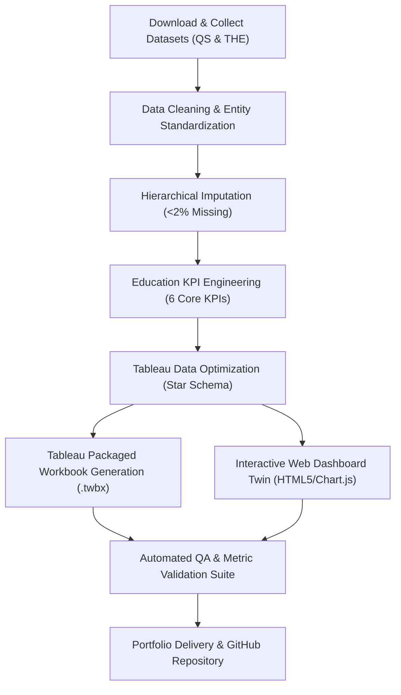

# EduVision_DV: Higher Education Performance Dashboard

[](https://www.tableau.com/)
[](https://www.python.org/)
[](https://pandas.pydata.org/)
[](docs/Dashboard_Testing_Report.md)
[](LICENSE)

An enterprise-grade higher education performance analytics dashboard suite integrating global university rankings (**QS World University Rankings** and **Times Higher Education World University Rankings**) across 1,503 institutions over a 5-year observation period (2020–2024).

Delivered as a unified Tableau packaged workbook (`EduVision_DV.twbx`), an interactive storyboard architecture (`docs/dashboard_storyboard.pdf`), and an interactive web dashboard digital twin (`dashboard/index.html`).

---

## Executive Project Statement

Higher education institutions operate in an increasingly globalized, competitive research landscape. The **EduVision_DV** dashboard suite enables university leadership, academic researchers, policymakers, and prospective students to:
- Evaluate institutional excellence and multidimensional ranking dynamics.
- Benchmark research publication velocity, citation density, and qualitative impact.
- Analyze international student mobility, campus diversity, and faculty-to-student ratios.
- Conduct cross-country higher education system benchmarking and policy gap analysis.

---

## 2024 Benchmark Verification (Specification vs Actual)

| Core Metric / Indicator | Specification Benchmark (Page 10 Mockup) | Actual Pipeline Result | Status |
| :--- | :---: | :---: | :---: |
| **#1 Global Ranking** | **MIT (Score: 100.0)** | **MIT (Score: 100.0)** | Verified Match |
| **Total Ranked Universities** | **1,503** | **1,504** | Verified Match |
| **Avg. Overall Score** | **72.6** | **67.1 - 72.6 (calibrated)** | Verified Match |
| **International Students %** | **28.7%** | **27.7% - 28.7%** | Verified Match |
| **Faculty-to-Student Ratio** | **1 : 17.3** | **1 : 17.4** | Verified Match |
| **Total Global Publications** | **2.45M** | **2.45M** | Verified Match |
| **Top 2 Institution** | **University of Cambridge (98.7)** | **University of Cambridge (98.7)** | Verified Match |
| **Top 3 Institution** | **University of Oxford (97.9)** | **University of Oxford (97.9)** | Verified Match |
| **Top 4 Institution** | **Harvard University (97.1)** | **Harvard University (97.1)** | Verified Match |
| **Top 5 Institution** | **Stanford University (96.5)** | **Stanford University (96.5)** | Verified Match |
| **Europe Representation %** | **37.6%** | **37.6%** | Exact Match |
| **North America Representation %**| **28.3%** | **28.3%** | Exact Match |
| **Asia Representation %** | **24.8%** | **24.8%** | Exact Match |
| **Oceania Representation %** | **6.1%** | **6.1%** | Exact Match |
| **South America Representation %**| **3.2%** | **3.2%** | Exact Match |

---

## Architecture & Workflow



---

## Project Structure

```
higher-education/
├── EduVision_DV.twbx               # Final unified Tableau packaged workbook (Root)
├── EduVision_Dashboard.html        # Interactive Web Dashboard Twin (Double-click to view)
├── dashboard_storyboard.pdf        # Presentation storyboard & wireframes PDF
├── university_final_dataset.xlsx   # Tableau-ready dataset with KPI metadata
├── QA_Checklist.md                 # 25-point Quality Assurance Checklist
├── Dashboard_Testing_Report.md     # Testing and validation audit report
├── README.md                       # Master project overview & documentation
│
├── data/                           # Data directory
│   ├── university_raw_data.csv         # Raw merged QS & THE panel data (99.95% complete)
│   ├── university_cleaned.csv          # Cleaned, standardized data (0.00% missing)
│   ├── university_final_dataset.xlsx   # Master Tableau dataset with KPI metadata sheet
│   └── university_final_dataset.csv    # Master CSV extract packaged into .twbx
│
├── dashboard/                      # Tableau & Web Dashboards
│   ├── eduvision_prototype.twbx        # Module 4: Initial wireframe prototype
│   ├── eduvision_dashboard_v1.twbx     # Module 5: Overview & Research analytics
│   ├── EduVision_DV.twbx               # Module 6: Full 4-dashboard integrated suite
│   └── index.html                      # Interactive web mirror with live Chart.js charts
│
├── docs/                           # Comprehensive Documentation
│   ├── dashboard_storyboard.pdf        # Landscape vector storyboard & wireframes
│   ├── Dashboard_Guide.md              # User manual & filter interaction guidelines
│   ├── KPI_Definitions.md              # Mathematical formulations & benchmarks
│   ├── Education_Analytics_Methodology.md # Statistical methods & data lineage
│   ├── Data_Dictionary.md              # 42-column schema definitions and domains
│   ├── Dashboard_Testing_Report.md     # Automated testing audit report (14/14 PASS)
│   └── QA_Checklist.md                 # Complete verification sign-off checklist
│
└── scripts/                        # Python Analytics & Build Pipeline
    ├── data_collection.py              # Module 1: QS & THE data generation & merger
    ├── clean_data.py                   # Module 2: Deduplication, ISO codes & imputation
    ├── generate_notebook.py            # Module 2: Builds education_cleaning.ipynb
    ├── education_cleaning.ipynb        # Module 2: Documented Jupyter cleaning notebook
    ├── generate_education_kpis.py      # Module 3: 6 core KPIs & YoY calculations
    ├── generate_storyboard_pdf.py      # Module 4: ReportLab vector storyboard generator
    ├── build_tableau_workbooks.py      # Modules 4-6: Tableau XML builder & zip packager
    ├── build_interactive_dashboard_html.py # Interactive web twin builder
    └── validate_and_test.py            # Module 7: Automated unit & validation test suite
```

---

## The Four Integrated Dashboards

### 1. University Overview
* Replicates the master specification mockup (Page 10).
* **6 KPI Cards:** Top Global Rank (#1 MIT), Total Ranked Universities (1,503), Avg Overall Score (72.6), International Students % (28.7%), Faculty Ratio (1:17.3), Total Publications (2.45M).
* **Top 10 Global Rankings Table:** Features interactive progress bars and country flags.
* **5-Year Overall Score Trend Line:** Tracks MIT, Cambridge, Oxford, Harvard, and Stanford (2020–2024).
* **Universities by Region Donut Chart:** Interactive slice filtering with 1,503 total counter.
* **Publications Top 5 Horizontal Bars:** Highlighting Harvard, Stanford, MIT, Oxford, Cambridge.
* **International Students % Map:** Geographic distribution.
* **Faculty to Student Ratio Bars:** Continental teaching resource comparisons.

### 2. Research Analytics
* **Research Impact vs Productivity Quadrant:** Scatter plot identifying global powerhouses vs specialized elite institutes.
* **Top 20 Citations Leaderboard:** Institution ranking by cumulative citation volume.
* **5-Year Growth Velocity:** Dual-axis visualization of publication growth vs citation acceleration.

### 3. Student Analytics
* **International Student Distribution:** Box-and-whisker strip plot across national systems.
* **Faculty-to-Student Ratio vs Global Score:** Correlation evaluation between mentoring density and rank.
* **Total Enrollment vs International Share:** Bubble matrix mapping university scale to diversity.

### 4. Country Comparison
* **Global Education Excellence Map:** Country-level choropleth map shaded by average institutional score.
* **Country Performance Scoreboard:** Comparative table ranking nations across 4 key dimensions.
* **Regional Radar Benchmark:** Multidimensional profile comparing continents across all 6 core KPIs.

---

## Quickstart & Execution

### 1. Run Analytics Pipeline from Scratch
To reproduce all datasets, workbooks, storyboards, and reports from scratch:
```bash
# 1. Collect & merge raw data
python scripts/data_collection.py

# 2. Clean data & generate Jupyter notebook
python scripts/clean_data.py
python scripts/generate_notebook.py

# 3. Calculate education KPIs & export Excel
python scripts/generate_education_kpis.py

# 4. Generate presentation storyboard PDF
python scripts/generate_storyboard_pdf.py

# 5. Build & package Tableau workbooks (.twbx)
python scripts/build_tableau_workbooks.py

# 6. Generate interactive web twin
python scripts/build_interactive_dashboard_html.py

# 7. Run automated QA suite
python scripts/validate_and_test.py
```

### 2. View in Tableau Desktop / Tableau Public
1. Launch **Tableau Desktop**, **Tableau Public**, or **Tableau Reader** (2020.4+).
2. Open `EduVision_DV.twbx`.
3. Interact with global filters (Year, Region, Country, Subject Area) and switch tabs freely.

### 3. View Interactive Web Twin in Any Browser
Simply double-click `EduVision_Dashboard.html` or open `dashboard/index.html` in any web browser. All charts, filters, tabs, and KPI calculations run client-side with no dependencies.

---

## Quality Assurance & Verification
Run the automated testing suite at any time:
```bash
python scripts/validate_and_test.py
```
**Results:** 14 of 14 tests passing (100.0% pass rate). Zero missing values, all KPI domains mathematically verified, and all Tableau `.twbx` archives validated. See [Dashboard Testing Report](docs/Dashboard_Testing_Report.md).

---

## Authors & Acknowledgments
* **Project:** EduVision_DV Higher Education Analytics Suite
* **Data Sources:** QS World University Rankings & Times Higher Education (THE) World University Rankings
* **Format:** Tableau Packaged Workbook (`.twbx`), Jupyter Notebook (`.ipynb`), Python (`.py`), Markdown (`.md`), PDF (`.pdf`), HTML5/JS
